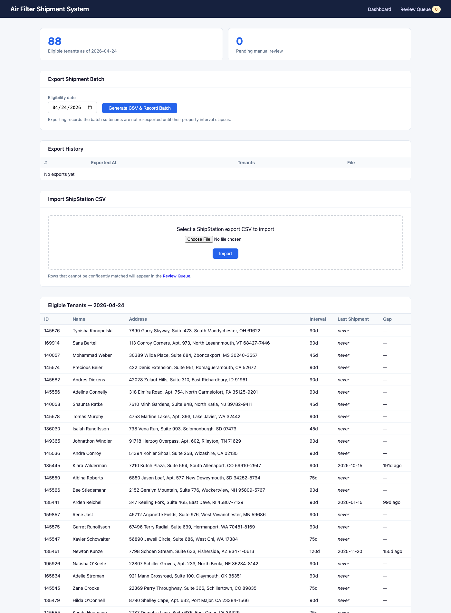
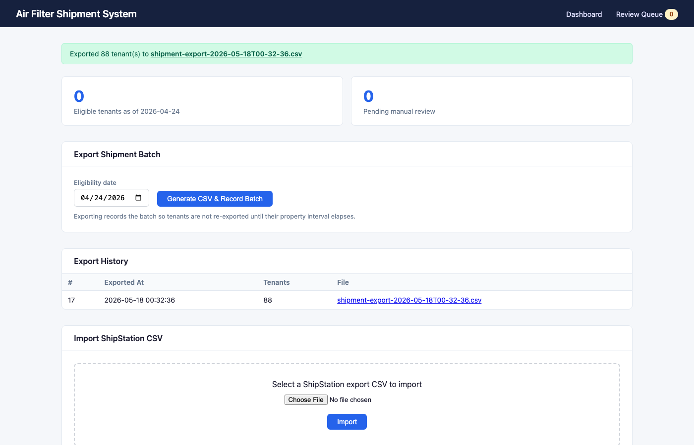
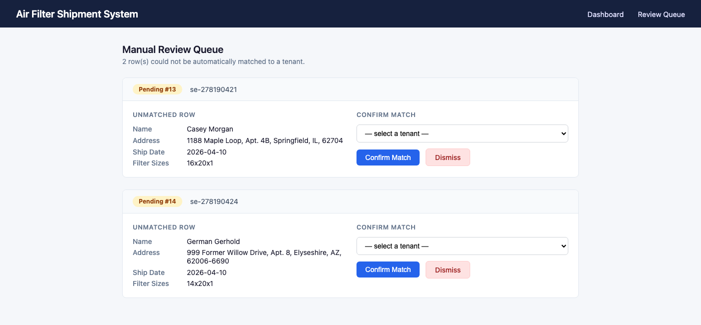

# Air Filter Shipment System

A small operational system for a renters insurance company that mails air filters to its customers. Built as a Node.js / Express web app on SQLite.

---

## The Problem

The insurance company sells a "Renters Kit" plan; one add-on is **filter delivery** — every X days, the customer should receive a new HVAC air filter in the mail. The fulfillment partner (ShipStation) handles physical shipping; this system is the operational glue:

> Figure out who's due → hand a CSV to the shipper → ingest the shipper's confirmation CSV back → resolve any matches that aren't obvious.

The spec asked for four things. Each is described below alongside what was built, with screenshots.

---

## Requirement 1 — Data Model

> *"Add tables for Property and Shipment. Use `properties.json` as the source of property shipment intervals. Choose a reasonable fallback approach for property data that cannot be applied cleanly."*

**What was built.** Seven new tables layered on top of the three fixture tables (`tenants`, `enrollments`, `historical_shipments`):

| Table | Purpose |
|-------|---------|
| `properties` | Property name and shipment interval; seeded from `properties.json` at startup |
| `tenant_properties` | Many-to-many tenant↔property join (handles tenants assigned to multiple properties) |
| `export_batches` | One row per CSV export run (timestamp, row count, filename) |
| `shipment_orders` | One row per tenant per batch — blocks re-export until interval elapses |
| `shipments` | Confirmed shipments created when import rows are matched to a tenant |
| `pending_imports` | Unmatched import rows queued for manual review |
| `filter_sizes` | Parsed filter dimensions, linked to a shipment or pending import |

**Fallback for orphan tenants.** 36 tenants are present in the fixture database but absent from `properties.json` (32 of them have eligible enrollments). Without a fallback they'd be silently excluded from eligibility. The seeder creates a synthetic property (`prop-unassigned-default`, 90-day interval — the modal value across configured properties) and auto-assigns them, logging a startup warning so the data gap stays visible.

---

## Requirement 2 — Eligibility Engine

> *"Determine which tenants are eligible to receive a shipment as of 2026-04-24: active Renters Kit enrollment with an air-filter delivery rider, and have not received a shipment within the property's interval."*

**What was built.** The dashboard at `/` shows the full eligible list. The same logic is exposed at `GET /api/eligible?as_of=YYYY-MM-DD` for programmatic use.

**Result against the fixture data: 88 eligible tenants as of 2026-04-24.**

The eligibility query unions three sources of "last shipment" — `historical_shipments`, confirmed `shipments`, and pending `shipment_orders` — and compares the most recent against the tenant's property interval. Rider matching is a label rule (contains `"airfilter"` and `"delivery"`, case-insensitive) so both fixture variants (`"Free Airfilters Delivery"`, `"Airfilters Delivery ($4)"`) are picked up without an allowlist.



---

## Requirement 3 — Shipment Export

> *"Generate a CSV of eligible tenants with at minimum recipient name and address. Record the export so tenants aren't immediately re-exported. Think carefully about what 'recording an export' means."*

**What was built.** Clicking **Generate CSV & Record Batch** writes a CSV to `exports/`, creates a row in `export_batches`, and inserts one `shipment_orders` row per tenant. The eligibility engine treats the `shipment_orders` as the tenant's most recent shipment event, so they immediately drop off the eligible list.

**Recording strategy.** The block kicks in at *order* time, not at *delivery confirmation*. A shipment has been ordered; re-ordering before the order resolves would be wasteful. If an order is cancelled, an operator clears the `shipment_orders` row (cancellation flow is a future improvement). The README's "What I'd Improve" section calls this out.

The screenshot below shows the dashboard immediately after an export: the green banner with a download link, the eligibility counter dropped to 0 (proving the block works), and the new entry in Export History.



CSV columns: `recipient_name`, `address1`, `address2`, `city`, `state`, `zip`, `tenant_id`, `interval_days`, `last_ship_date`.

---

## Requirement 4 — Shipment Import + Manual Review

> *"Ingest the ShipStation CSV and match each row to a tenant. Decide what counts as a confident automatic match. Flag low-confidence rows for manual review. Parse filter sizes from `custom_field_1` — if a size can't be used, capture enough info for follow-up without blocking the row. Build a simple UI to resolve unmatched rows."*

**What was built.** Upload a CSV via the dashboard's Import form. The pipeline runs each row through a scored matcher:

| Field matched (normalized) | Points |
|---|---|
| Full name | 50 |
| Address line 1 | 30 |
| City | 10 |
| State | 5 |
| ZIP | 5 |

A row is auto-matched only when **a single candidate scores ≥ 80 with no tie at that score**. The 80-point threshold guarantees a full-name match plus an address component — name alone is insufficient given that names can collide across tenants.

**Result on `shipstation-export.csv` (195 rows):**

| Outcome | Count |
|---|---|
| Auto-matched → `shipments` | 193 |
| Unmatched → `pending_imports` (review queue) | 2 |
| Duplicates / invalid | 0 |
| Filter sizes parsed | 203 |
| Filter sizes failed-soft (e.g. `"twenty-by-twenty"`) | 1 |

**Manual review UI.** The two unmatched rows surface the matcher's reasoning to the reviewer. Each card shows the unmatched row's data, the candidate tenants (ranked by score), and — critically — **the top candidate's score and the auto-match threshold**, so the reviewer can see *why* the row was flagged at a glance:

- **Casey Morgan** scored **100** — a tie. Two tenants have identical name + address in the fixture data, so the matcher refused to pick one.
- **German Gerhold** scored **70** — below the 80 threshold because his ShipStation address differs from his tenant record (he moved).



Confirming a match creates the `shipments` record and migrates the filter sizes from the pending row onto the confirmed shipment. Dismissing a row removes it from the queue.

---

## Setup & Running

**Prerequisites:** Node.js ≥ 18, `sqlite3` CLI (for fixture seeding only).

```bash
npm install
npm start
# → http://localhost:3000
```

Other scripts:

```bash
npm test          # 7 smoke tests against an isolated DB copy
npm run reset     # clears generated data, leaves fixtures intact
npm run seed-fixtures  # re-apply the supplemental fixture SQL
```

The database (`database.db`), property configuration (`properties.json`), and ShipStation CSV (`shipstation-export.csv`) all ship in the repo.

### Endpoints

| Endpoint | Description |
|---|---|
| `GET /` | Dashboard |
| `GET /review` | Manual review queue |
| `POST /export` | Generate and record an export batch |
| `POST /import` | Multipart upload of a ShipStation CSV |
| `POST /review/:id/match` | Confirm a manual match |
| `GET  /review/:id/dismiss` | Dismiss a pending row |
| `GET /api/eligible?as_of=YYYY-MM-DD` | JSON list of eligible tenants |
| `GET /exports/:filename` | Download a generated CSV |

---

## Assumptions & Tradeoffs

**Rider normalization is a rule, not an allowlist.** Any rider whose label contains both `"airfilter"` and `"delivery"` (case-insensitive) counts. A new variant like `"Airfilters Delivery ($6)"` would match without a code change. An exhaustive allowlist would be more explicit but would require updates whenever rider names change.

**Property conflicts collapse to the most conservative interval.** When `properties.json` assigns a tenant to multiple properties with different intervals, the eligibility query uses `MIN(interval_days)`. Shorter interval = more conservative = avoids over-shipping relative to any property's policy.

**Export blocks at order time, not delivery time.** See Requirement 3.

**Match confidence is exact-on-normalized.** Names and addresses are normalized (lowercase, collapse whitespace, strip punctuation) before exact comparison. No fuzzy matching — typos go to manual review. Fuzzy matching (Levenshtein/Jaro-Winkler) is in the "future improvements" list.

**Ties always go to manual review.** Even at score 100, if two candidates tie, the row is flagged. Better to ask a human than guess wrong.

**Filter-size parse failures don't block the row.** If `custom_field_1` is unparseable, the size is stored with `parsed_ok=0` and `parse_error`; the shipment itself still imports. Operations gets a follow-up queue, not a dropped record.

**Server-rendered HTML, no JS framework.** The UI is small enough that a SPA would be overkill. All escaping goes through an `esc()` helper to prevent XSS from CSV-uploaded data.

---

## Data Issues Found

| Issue | Impact if ignored | Handling |
|---|---|---|
| `prop-riverbend` ID duplicated in `properties.json` (different name + interval) | Silent overwrite on naive upsert | Detected at startup, first occurrence wins, conflict logged |
| Tenant assigned to two properties with different intervals | Ambiguous eligibility interval | `MIN(interval_days)` — conservative |
| **36 tenants in DB with no property assignment** (32 are otherwise eligible) | **Silent exclusion from eligibility** | Synthetic default property (90d interval) + startup warning |
| `historical_shipments` row dated 2026-05-15 (after the 2026-04-24 eligibility date) | Future shipment would incorrectly block eligibility | Query caps history at `ship_date <= as_of` |
| `riders` stored as PostgreSQL-style array literals `{A,B,C}` | Not queryable with SQLite JSON functions | Parsed in JS: strip braces, split on commas |
| One CSV row has size text `"twenty-by-twenty"` instead of `LxWxD` | Would block the row if treated fatal | Stored with `parsed_ok=0` + `parse_error`; row imports normally |
| ShipStation `ship_date` is UTC ISO-8601 | Local-time conversion shifts the date in some timezones | `formatDate()` uses `getUTC*` components |
| Casey Morgan exists ×2 in fixture with identical name and address | Auto-matcher would arbitrarily pick one | Tie detection routes to manual review |
| German Gerhold's ShipStation address differs from tenant record | Score 70 < threshold 80, so unmatched | Manual review (with score shown) lets the operator confirm |

---

## What I'd Improve With More Time

- **More tests.** Current suite covers rider parsing, eligibility bounds, import statistics, and soft-fail size parsing. I'd add per-route integration tests, property-fallback coverage, and adversarial CSV inputs.
- **Authentication.** Even a simple session-based login before this touches real tenant data.
- **Batch cancellation.** Allow an operator to void an export batch if shipments weren't fulfilled, releasing those tenants for re-export.
- **Confirmed-order linkage.** The `shipment_orders.confirmed_shipment_id` column exists on the schema but isn't yet populated on import-match. Once it is, the eligibility query could skip orders whose confirmed shipment is already counted, avoiding double-counting near the interval boundary.
- **Pagination** on the eligible-tenants table and review queue.
- **Background import** for large files, with a progress indicator instead of blocking the HTTP response.
- **Property conflict resolution UI.** Surface conflicts to a human at import time rather than silently picking the first occurrence.
- **Fuzzy name matching** in the auto-matcher (Levenshtein / Jaro-Winkler) to catch typos.
- **Soft-deletes / audit log.** Review dismissals are currently destructive; a real system wants a history of who decided what.
